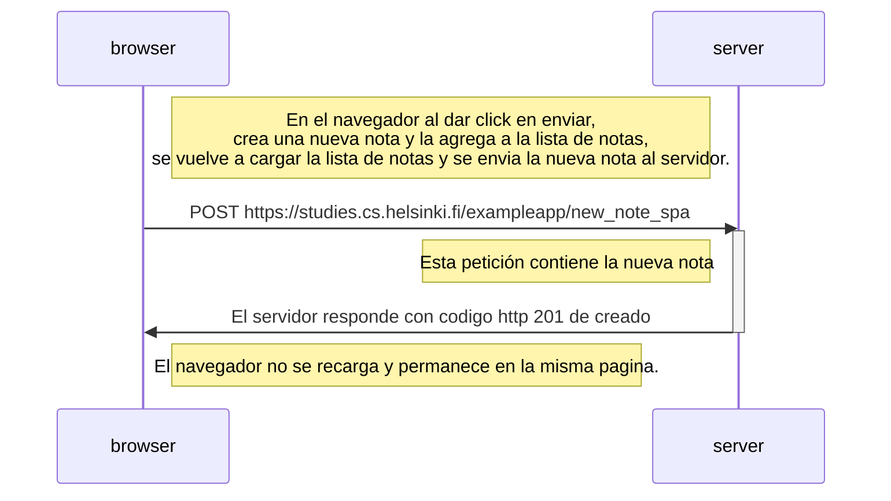

```mermaid
sequenceDiagram
participant browser
participant server

    Note right of browser: En el navegador al dar click en enviar,<br>crea una nueva nota y la agrega a la lista de notas,<br>se vuelve a cargar la lista de notas y se envia la nueva nota al servidor.

    browser->>server: POST https://studies.cs.helsinki.fi/exampleapp/new_note_spa
    activate server

    Note left of server: Esta petición contiene la nueva nota

    server->>browser: El servidor responde con codigo http 201 de creado
    deactivate server

    Note right of browser: El navegador no se recarga y permanece en la misma pagina.

```
